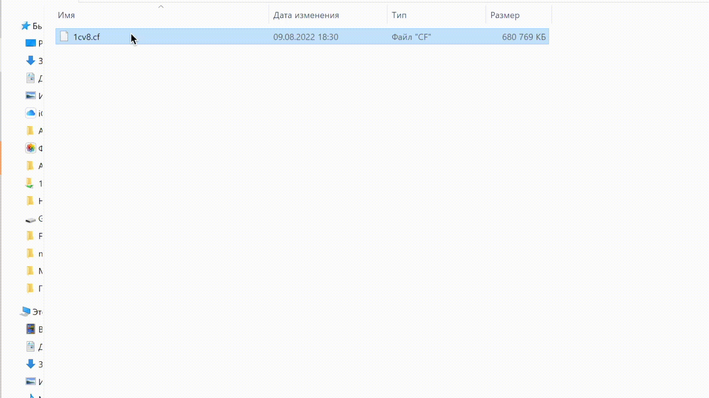

# Разворачивание баз и конфигураций
Скрипты для разворачивания и запуска .cf, .dt и .1CD

Предназначены, чтобы быстро и просто запускать файлы .cf, .dt и 1CD
Скрипты умеют создавать информационную базу и загружать в нее либо cf, либо dt, после чего открывать конфигуратор с этой базой.

## Описание

1. Cb83.bat предназначен для .dt
2. Cnb83.bat предназначен для .cf
3. Ob83.bat предназначен для .1CD в режиме конфигуратора
4. Ob83Enterprise.bat предназначен для .1CD в режиме предприятия

## Чтобы начать работу следует

1. Отредактировать скрипт и указать в нем путь к платформе в переменной V8Bin
2. Назначить скрипт Cb83.bat как программа по умолчанию для открытия файлов с расширением .dt
3. Назначить скрипт Cnb83.bat как программа по умолчанию для открытия файлов с расширением .cf
4. Назначить скрипт Ob83.bat как программа по умолчанию для открытия файлов с расширением .1CD

## Пример работы

