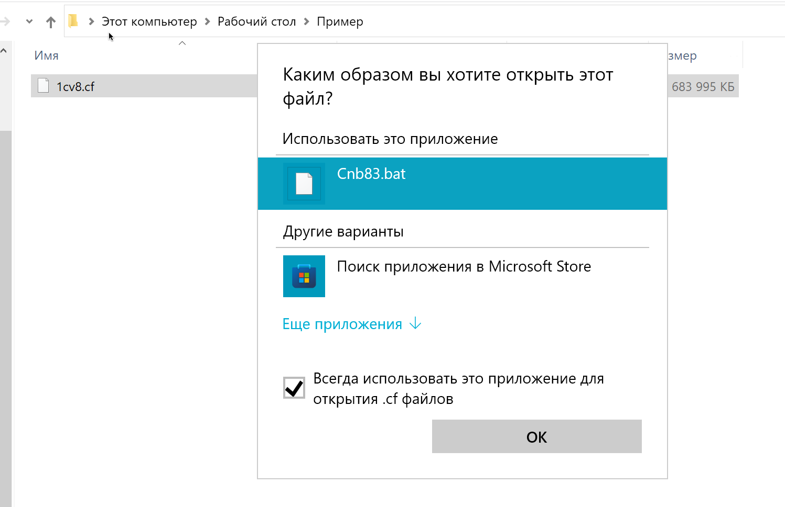

# Разворачивание баз и конфигураций

Скрипты для разворачивания и запуска .cf, .dt и .1CD

Предназначены, чтобы быстро и просто запускать файлы .cf, .dt и 1CD
Скрипты умеют создавать информационную базу и загружать в нее либо cf, либо dt, после чего открывать конфигуратор с этой базой.

## Описание

0. platform_version.txt - файл, в котором указываем версию платформы
1. Cb83.bat предназначен для .dt
2. Cnb83.bat предназначен для .cf
3. Ob83.bat предназначен для .1CD в режиме конфигуратора
4. Ob83Enterprise.bat предназначен для .1CD в режиме предприятия

## Чтобы начать работу следует

1. Отредактировать файл с версией платформы, указать в скриптах нем путь к платформе в переменной V8Bin, по умолчанию это C:\Program Files\1cv8\%VERSION%\bin, где VERSION - это версия из файла platform_version.txt
2. Назначить скрипт Cb83.bat как программа по умолчанию для открытия файлов с расширением .dt
3. Назначить скрипт Cnb83.bat как программа по умолчанию для открытия файлов с расширением .cf
4. Назначить скрипт Ob83.bat как программа по умолчанию для открытия файлов с расширением .1CD

## Пример работы

